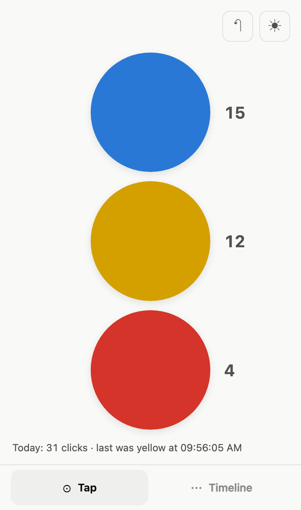
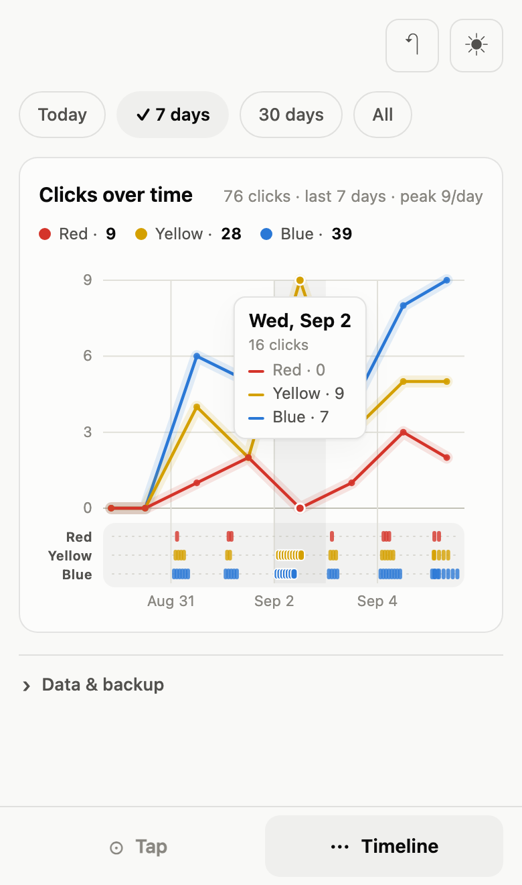

<p align="center">
  
</p>

<h1 align="center">Count the Dots</h1>

<p align="center">
  <strong>A free tally counter for anything you can be bothered to count.</strong><br>
  Three buttons — blue, yellow, red — stamp the time when you tap them.<br>
  A chart shows how many of each, per hour or per day.
</p>

<p align="center">
  <a href="https://app.countthedots.click"><strong>Open the app →</strong></a>
  &nbsp;·&nbsp;
  <a href="https://countthedots.click">countthedots.click</a>
</p>

<p align="center">
  
  &nbsp;&nbsp;
  
</p>

---

**Free · No account · Works offline · Nothing leaves your device**

Add it to your home screen and it behaves like an app with no signal at all. There
is no server, no sync and no analytics inside it: every click lives in your own
browser's `localStorage`, on the device that recorded it. The same source also builds
real iOS and Android apps — see `NATIVE.md`.

## What people count

| | |
|---|---|
| ☕ **Coffee** | Blue: morning. Yellow: the one you called decaf. Red: after bedtime. |
| 📉 **Habits you are cutting down** | No streaks, no badges, nothing calling you a quitter. |
| 🩺 **Pain, 1 to 3** | Blue mild, yellow bad, red worse — all day, in order. Beats telling a doctor "a lot, I think? Mostly evenings?" |
| 🐦 **Birds, trains, passing cars** | Field notes for people who enjoy counting things at other things. |
| 🙋 **Interruptions** | Count for a week. Then show the chart to whoever caused them. |

## Using it

| | |
|---|---|
| Tap a colour | records a click at the current time |
| Keys `1` `2` `3` | same, on a desktop keyboard — `1` blue, `2` yellow, `3` red |
| Today / 7 / 30 / All | scopes the chart — opens on **7 days** |
| Hover or tap the chart | bands the period around the nearest tap and gives all three colours' counts for it |
| | a **tap pins** that reading — dismiss it by tapping outside the chart, or `Esc` |
| ↶ | undo the last click — in the top bar, so it is reachable from the pad |
| Delete all | inside **Data & backup**; a warning appears first, with Export beside it |
| ◐ | cycles theme: auto → light → dark |
| Export | back the log up, or move it to another device |
| Import | merge a file back in — see **Import merges by day** below |
| Data & backup | the export/import row collapses; the state is remembered |

The buttons carry no numerals — the colour *is* the identity, and the badge on each one
counts **today**. The range chips scope the chart. The Timeline screen is the chart and
an export/import pair, nothing else: no log table, no clear. Undo lives in the
top bar instead, next to the theme toggle, so a mistaken tap can be dropped without
leaving the pad; it greys out when the log is empty.

## Privacy

**Your click data never leaves your device.** It lives in the browser's `localStorage`
on the phone you tap on — there is no server, no database, no account, no analytics.
The published page is just static HTML/CSS/JS.

The site is publicly reachable even though this repo is private, which is fine: the
URL serves the empty app to anyone who finds it, and your recorded times aren't in it.

The phone apps change nothing here. Tips go through the store's own purchase sheet, so
no payment detail reaches this code either, and the App Store and Play privacy
declarations are both **Data Not Collected**.

Use **Export** for a backup before clearing browser data — clearing site data for
the domain deletes the log.

## Installing it

From the web, as a PWA:

1. Open <https://app.countthedots.click> in Chrome.
2. ⋮ menu → **Add to Home screen** (Chrome may offer **Install app** instead).
3. Launch from the icon — it opens standalone, no browser chrome.

On iOS: Safari → Share → **Add to Home Screen**.

There are also real iOS and Android builds of the same source, wrapped with Capacitor —
not yet submitted. `NATIVE.md` covers building and shipping them.

## How clicks are stored

Every tap appends `{ id, t, b }` (timestamp in epoch ms, button 1–3) to one array kept
in the browser's `localStorage` under the key `click-timeline/v1`, written synchronously
on every tap. That's the whole storage layer — no database, no API, no account, no sync.
The code makes zero network requests; the only `fetch` in the project is inside `sw.js`,
serving the app's own files for offline use.

The phone apps narrow this rather than widening it: `sw.js` is not in the native build at
all, because Capacitor already serves the files locally. The one thing that does reach
the network there is the purchase plugin talking to Apple or Google when the tip button
is pressed — and it carries a product id, nothing else. **No click ever leaves the
device on any build.**

What that means in practice:

* **Data is tied to one origin on one device.** Clicks recorded on
  `https://main.abc123.amplifyapp.com` are not visible from a different URL or a
  different phone. Moving hosts or adding a custom domain starts a fresh log — use
  **Export** on the old URL and **Import** on the new one.
* **The installed home-screen app and the same site in a Chrome tab share the log** —
  same origin, same profile, same storage.
* **It survives app restarts, reboots and going offline.** On first run the app calls
  `navigator.storage.persist()`, which asks Android not to evict the data when the
  device is low on space (granted silently for installed PWAs).
* **It does not survive "clear site data", uninstalling with storage cleared, or a
  factory reset.** Export a JSON backup if the history matters.

### Import merges by day

**Import is not a dedupe-and-append.** Every local calendar day the file mentions
*replaces* whatever is recorded here for that day; every day the file says nothing about
is left exactly as it is. So re-importing a corrected Tuesday fixes Tuesday rather than
doubling it, and importing one device's Tuesday never touches the Wednesday you only
have here.

The consequence: importing a day you already have **discards** the local version of that
day, and undo only pops the newest click, so there is no way back. Import therefore
prompts before it destroys anything — naming how many days and how many clicks are at
stake — and only when the file actually overlaps days that already have clicks.

Malformed entries are skipped; a click needs a finite `t` and a `b` of 1, 2 or 3.
Imported clicks are given fresh ids, so a file exported from another device can never
collide with what is already here.

## Deleting everything

**Delete all** lives inside the collapsed **Data & backup** drawer, beside Export
and Import — a rare, irreversible action has no business sitting on screen all
day. It deletes nothing on its own: pressing it opens a warning saying the
action cannot be undone, with Export one button away at the moment that matters
rather than a sentence somebody has already scrolled past.

Quiet trigger, loud confirm — the button that opens the warning is outlined, the
one that carries it out is filled. Cancel and Escape both back out, collapsing
the drawer or switching screens closes it too, and it disables itself when there
is nothing left to delete.

Two friends asked for the feature independently, which is a better signal than
one person's taste — including the author's, who did not want another button.

## The milestone nudge

Every 100 clicks, once, the app asks for a coin: a small dialog titled with the
count, three amounts on three dots, and two ways out — *Nudge me at 200* or
*Never again*.

The dialog is the same everywhere. Only the payment rail differs, because the
two channels are allowed different things.

**On the web, tips go through Ko-fi**, which sits on top of a personal PayPal
account — the only route that works from Israel without a business number, a
company, or a Stripe country that isn't on the list. The tip link in
`index.html` is the entire configuration; while it still reads `REPLACE-WITH`,
**the popup never appears at all**, so a half-configured build cannot show
anyone a dead button.

**In the phone apps, tips go through in-app purchase.** An external payment
link is permitted on the US App Store storefront and nowhere else, so a Ko-fi
button shipped worldwide would violate guideline 3.1.1; IAP tipping is
explicitly allowed. Three consumables are registered (`tip_small` /
`tip_medium` / `tip_large`) and the button orders the middle one, showing the
store's own localised price rather than a hard-coded figure. The same guard
applies: until a real purchasable product comes back from Apple or Google,
nothing is armed and the dialog never appears. Consumables need no receipt
validation and no entitlement restore, so this adds no server and no
third-party SDK — see `NATIVE.md`.

**One action, not three amounts.** Ko-fi picks the amount on its own page (it
offers $1 / $5 / $10 there), so three dots promising those figures would all
land on the same picker and promise something the link cannot keep. The three
dots stay as the mark; the action is a single *Leave a tip*. That reasoning is
specific to Ko-fi — the phone apps *do* know the real prices, so a three-amount
dialog would be honest there, and is the obvious next version of this.

The limits, and which channel each one still binds:

* **The web build cannot tell whether you paid.** There is no server to hear
  back from. A tap on the link is the most it can observe, and that is what
  stops the asking — so someone can tap, not pay, and never be asked again.
  **The phone apps do know**: the purchase callback is a real signal, so only a
  completed payment stops the asking, and backing out of the sheet counts as
  *later*.
* **The answers live in `localStorage`.** Clearing site data resets them, and
  the nudge comes back.
* **Only a real tap triggers it.** An import can cross several milestones at
  once, and ambushing someone who just restored a backup would be rude.

## Chart notes

**The lines are plain counts.** Each one is how many clicks that colour got in each
period — an integer you could arrive at by hand from the log. Nothing is smoothed,
weighted, accumulated or stacked, so the axis only ever shows whole numbers and the
lines rise and fall independently. The period follows the visible span: per hour out to
2 days, per day to 120, then per week and per month. Periods are stepped with `Date`
methods rather than fixed millisecond offsets, so a DST change doesn't drift the
boundaries.

Each period's point sits at its midpoint, clamped so a part-covered first or last period
stays inside the axes. Per-period dots are drawn up to 60 periods, past which they'd be
noise.

**Nothing is filled.** With lines that cross, a wash under them reads as stacked area
and invites adding the values together, which would be meaningless here.

Under the lines, the **event rail** keeps the raw data visible: one row per colour (blue
at the bottom, so 1 → 3 reads upward), one tick per tap at its exact time. The lines
answer "how many, and is it changing"; the rail answers "when, exactly".

Hovering or tapping **selects a period, not a tap**: whichever period is under the
pointer's x is banded across the plot, every tap it counts lights up on the rail, and a
node lands on all three lines so the tooltip's three counts are visibly the three lines.
There is no proximity requirement — tapping a quiet stretch still answers "nothing that
day", which is a real answer. Putting the pointer on a rail row additionally emphasises
that colour's line in the tooltip. The subtitle carries the peak for the range.

**Hover previews, a tap pins.** A pinned reading survives `pointerleave` and is not
dragged around by subsequent hovering; tapping elsewhere on the chart re-pins, and
tapping outside it — or pressing `Esc` — dismisses it. Pinning is what makes the chart
usable on a phone at all: the browser fires `pointerleave` the instant the finger lifts,
so an un-pinned reading vanishes before it can be read.

The dismiss-on-outside-tap listener is registered in the **capture** phase, and must
stay there. `render()` rebuilds the whole SVG, so by the bubble phase the node that was
tapped has been detached and `svg.contains(target)` reports `false` for it — dismissing
the very reading the tap was meant to pin. Tapping blank chart hides the bug, because
there the target is the `<svg>` itself, which survives the rebuild; the smoke test
therefore taps marks directly.

On the 7- and 30-day ranges the subtitle also carries the change against the preceding
window. That delta is **only** shown when the log actually covers the preceding
window — otherwise "up 300%" would just be the history starting.

**Palette: blue, yellow, red**, in that order — button 1 is blue and sits at the bottom
of the rail. Storage is unchanged: clicks are still saved as `b: 1 | 2 | 3`, and the
colour is only how that number is presented.

Two honest caveats about this palette. A true lemon yellow is invisible as a 2px line on
a near-white surface, so the light theme uses a deep gold (`#d4a000`, ~3:1 against the
chart surface) and only the dark theme uses the brighter tone; and white-on-yellow fails
contrast, so the yellow button flips to dark ink on a light badge. Red and yellow also
sit closer together for red-blind viewers than the old blue/orange/aqua set did.

Identity is therefore never carried by colour alone: each rail row is labelled **Red** /
**Yellow** / **Blue** in text, the legend names them beside its per-range counts, the
tooltip names the tapped colour in words, and each pad button exposes its colour in its
accessible name.

## Layout

The app is one fixed-height flex column — top bar, a single scroll region (`<main>`),
tab bar — rather than a long page with a floating tab bar over it. The tap screen sizes
itself to that region and so **never scrolls at any viewport height**; the buttons shrink
instead. Only the timeline scrolls, and only inside `<main>`.

One trap that follows: `#panel-tap` sets `display: flex`, and an id selector outranks the
UA's `[hidden] { display: none }`, so a hidden panel stays painted. `styles.css` carries
an explicit `[hidden] { display: none !important }` reset for that, and the smoke test
asserts it is still there — jsdom has no layout, so nothing else would catch it.

## Files

```
index.html            markup
styles.css            tokens + layout (light/dark, both OS setting and manual toggle)
app.js                storage, SVG chart, export
manifest.webmanifest  PWA metadata
sw.js                 service worker — network-first, cache fallback
icon-192/512.png      three palette dots, generated by tools/make_icons.py (no image deps)
icon-1024.png         store listing icon, same generator
tools/smoke-test.mjs  jsdom smoke test (npm test)
deploy/               Amplify deploy script and runbook
tools/build-dist.sh   copies just the 7 shipping files into dist/

native.js             the only file that imports Capacitor — see NATIVE.md
tools/build-native.sh builds dist-native/: the web files plus the adapter, minus sw.js
capacitor.config.json appId, app name, webDir
ios/ android/         generated Xcode and Android Studio projects
NATIVE.md             store submission: prerequisites, IAP setup, the checklist
```

The web app does not know any of the native files exist. `build-dist.sh` still copies
the same seven files and the site still runs with no build step and no dependencies.

## Develop

```sh
npm run serve      # http://localhost:8731
```

Run the smoke test (~170 assertions over recording, curve geometry and the shared count
scale, the event rail, filters, hover, persistence, export, theme, and the native
adapter's branches):

```sh
npm install && npm test
```

Regenerate icons after changing the palette:

```sh
npm run icons
```

**When deploying a change, bump `CACHE` in `sw.js`** so installed clients pick it up.

Build the phone apps (needs Xcode / Android Studio — see `NATIVE.md`):

```sh
npm run ios        # build, sync, open Xcode
npm run android    # build, sync, open Android Studio
```

The native projects hold *copies* of the web files, so `npm run sync` after any edit to
`index.html`, `styles.css`, `app.js` or `native.js` — otherwise the change is invisible
to them.
